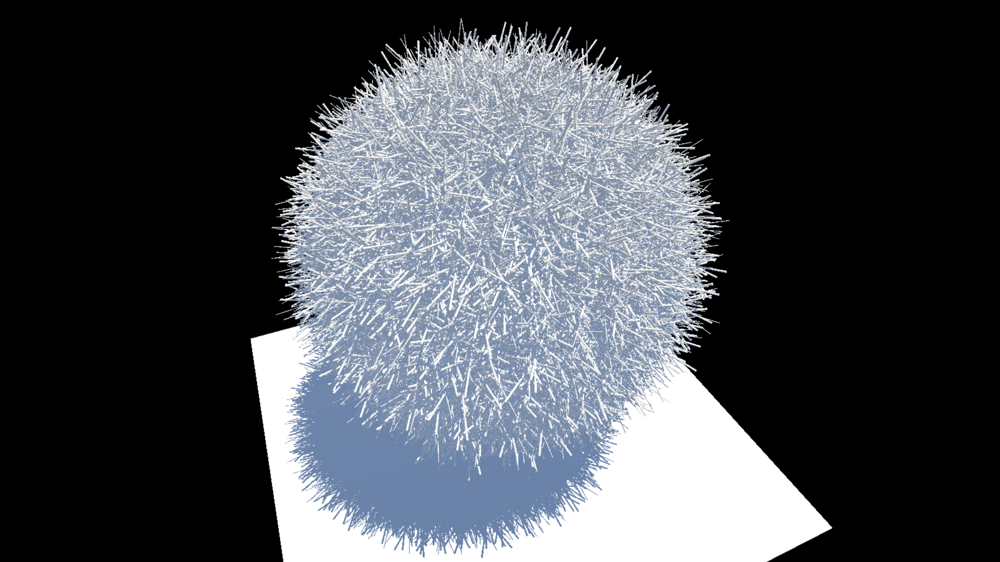
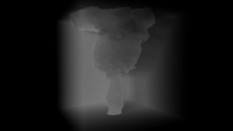

# Hello! My name is Bryan.

## I'm a software engineer living in Toronto, Canada. I co-founded VNovus and launched VRPlayin which has brought the joy of VR to tens of thousands of Torontonians. Before that I worked at Mi9 Business Intelligence as a backend/database developer.

## I didn't learn my data structures, algorithms and design patterns in a classroom but through years of hands-on experiences, and I can't get enough of them. I pride myself on being able to think like a programmer and solve problems like an engineer.

## I also have a strong interest in graphics programming. Compute shaders opened the door to parallel computing for me and I've been madly in love with them ever since. I've built my own rendering engine and toyed with procedural generation and physics simulation. I've brought to life a R&D project of using VR sculpting to generate models for 3D printing.

## I'm mostly a software guy but I'm no stranger to a soldering iron. I've made many contraptions using RPi, Arduino or STM32 boards. I'm also a RC hobbyist who have built, flown and crashed a lot of model airplanes, helicopters and quadcopters.

## I'm currently looking for the next big challenge to take on. Feel free to grab a copy of my [resume](./assets/bryan_bai_resume.pdf) or send me a [email](mailto:byebyebryan@gmail.com).

# Projects

### [VRPlayin](./vrplayin.html)

A programmer's approach to designing a VR arcade

### [Project R](./projectr.html)

From VR sculpting to 3D printing

### [Cubey](./cubey.html)

A OpenGL compute shader playground

