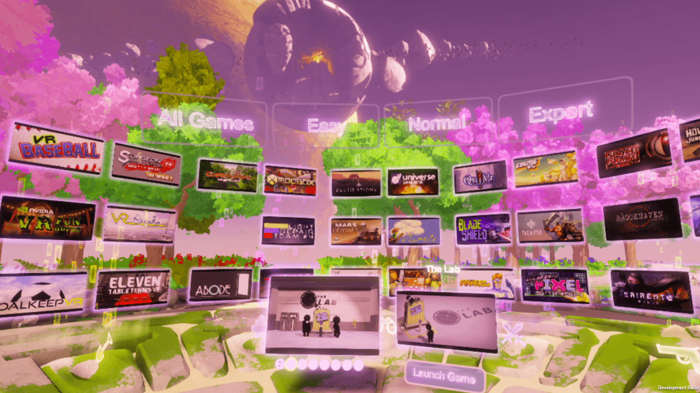
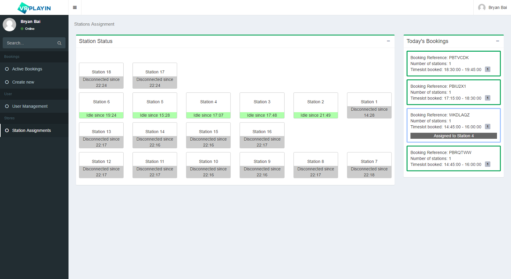
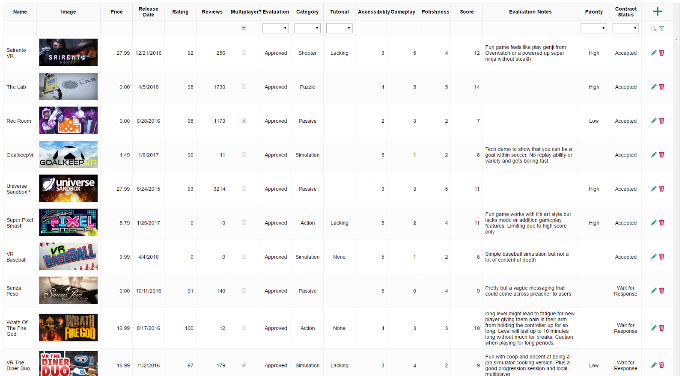
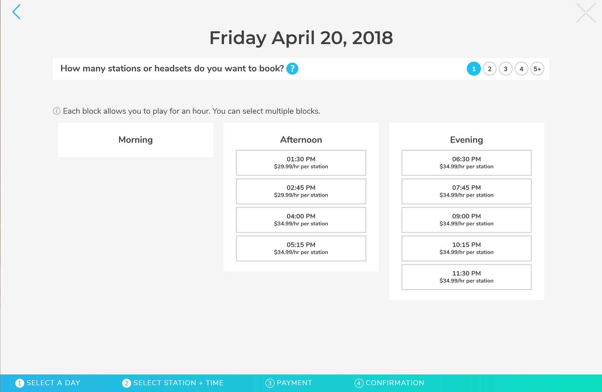

# VRPlayin
## A programmer's approach to designing a VR arcade

### The Story

Two years ago Bill, Andy and me started our own company and decided our first project was to build a VR arcade to bring the joy and excitement of VR to the masses.

Back at the time there were only a handful of VR arcades around and globe and only one in Canada, so we weren't the first to arrive at the game but were among the pioneers.

One thing jumped out immediately to us during the initial research was the low-fi approach others were taking to run VR arcades. It was not uncommon to see staff opening/closing games for customers using keyboard/mouse, and play sessions tracked using a stop watch. It was inefficient, inconvenient, and rather embarrassing for places that were built around the most cutting-edge gaming technology.

When it came to designing our own VR arcade, we decided we would do things very differently, by following a core idea:

> Anything that could be automated, should be automated.

So I assembled my team, and worked fanatically for the next few months towards the ambitus goal of creating a first-of-its-kind end-to-end VR arcade management solution, or in layman's terms, a VR arcade that could practically run itself.

### The Launcher

The first and most obvious missing piece to the puzzle was a dashboard where customers can browse through games and pick whatever they want to play without help from the staff and without taking off the headset.

The way I thought about designing a dashboard for VR was that it would be less similar to a traditional menu, but more like the hub worlds in video games. So essentially this part of the project was to develop a VR game level. And this was what our internal dev team spent most of their time on.

Apart from the tropical island on an alien planet scene, the team also built a short but fun tutorial, basically a set of mini games, that would get the customer familiar with VR essentials such as how to use the VR controller, and how they can move around freely in the VR environment (you'd be very surprised how many people just freeze and lock up the first time they put on a VR headset).

The tricky part was we were dealing with a first gen technology in its early stages. We were using Unity 5.6 which only had limited support for VR applications, and even the low level SteamVR/OpenVR SDK was not without a fair share of problems. A lot of effort went into working around those problems and ensuring the reliability of the application. After all it was the launcher and it should never crash.

Last but not least we also built into the launcher functionalities to allow reporting to and receiving commands from a server backend. At the time it was first-of-its-kind to provide such capability and was a key piece to allow automation of most of the management processes.

### The Governor

We called it the governor because this was the heart of the store management framework.

It talks to the website for handling online bookings. Upon the customer's arrival and signing the wavier (BTW we also built a web tool for signing wavier electronically), it assigns stations, unlocks the stations, and starts tracking the session, and notifies the customer and locks the stations when time is up, all without human intervention.

Also it constantly receives status updates from the launcher, and notify the staff when any problem arises, for example a station constantly crashes, or the Vive controller ran out of battery. Actually I took it a step further and also gather some play data, for example what game was being played for how long, or even details like how much time a game spend on loading. Such data are used to calculate royalty payments for certain titles, and they can be sent to the developer for feedbacks.

### The Scout

One daunting task I faced was to select a collection of VR games/apps to be used in the arcade. At the time the VR content market was truly the wild west, with a wide variety of games popping out everyday, and huge discrepancies between the quality of games.

Originally, I built a tool that would poll from the Steam api for VR contents, scrap the store page for extra information, and generate a CSV file which I then imported into Excel, which was already a huge help for selecting the titles and contact the developers.

Then I evolved it into a full-blown content management platform, where it periodically scans for new titles, store them in an internal database and pre-filter them based on review scores.

It also allows the staff members to submit evaluations/reviews so they can contribute to the content selection process.

For the selected titles, it downloads media contents (screenshots, videos) from the steam store, process them, and feeds them to the launcher for display in the dashboard.

### The Website

I must say the web team really did a fabulous job of building the web frontend.
