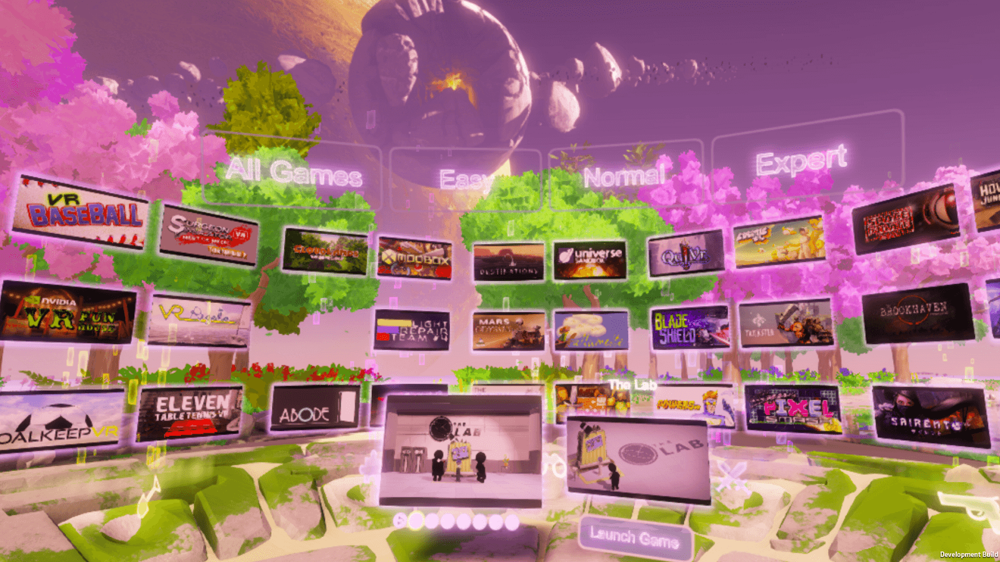

# VRPlayin
## A programmer's approach to designing a VR arcade

### The Launcher

The first and most obvious missing piece is a dashboard for the customers to browse through all the games they can enjoy and choose whatever they want to try.
This is where our internal dev team spent most of their time on.
What's unique about a launcher for VR arcades is that it's less like the traditional menu but more of a game scene.
We wanted to have a environment where the customers can feel relaxed and welcomed, so we built choose a tropical island on an alien planet theme.

Something else worth mentioning here is that the launcher talks to a server backend.
At the time it was really first-of-its-kind to provide such capability and allowed most of the automation functions to work properly.

### The Governor

We call it the governor because this is the heart of the arcade management infrastructure.
It receives request from the retail system about upcoming play sessions and assign stations accordingly.
Once a play session starts, it tracks the and ends the session, and send notification to the customer at various times, for example 5 minutes prior to the end.
Also it constantly receives status updates from the launcher, and notify the staff when any problem arises, for example a station constantly crashes, or the Vive controller ran out of battery.
Actually we took it a step further and also gather some play data, for example what game was being played for how long, or even details like how much time a game spend on loading.

### The Store Manager

The retail system mostly deal with things like booking and payment processing.
It sounds simple but there is actually a fair amount of business logic going on here.
And I must say the web team really did a fabulous job of building the frontend.

### The Scout

This is more of a behind the scene kind of component.
From a customer's perspective, the most important aspect of a VR arcade is the library of games it provides.
At the time the VR content market was really the wild west, as there were huge discrepancies between the quality of the games, and new titles were popping out everyday.
That means the selection of content in itself was already a non-trivial task.
So I built a tool to help with that.
It periodically poll from the steam store api and check for new VR contents.
It scrubs the steam store page checking for reviews and performs a pre filter process, eliminating games with too few reviews or too many bad reviews.
It allows the internal team to submit evaluations for any game they like/dislike.
It can be used to track the negotiation process when we decide to reach out to a particular developer regarding their game
It also tracks the pricing information regarding any title, and combining with the play statistics from the governor, calculates the royalty payments.
